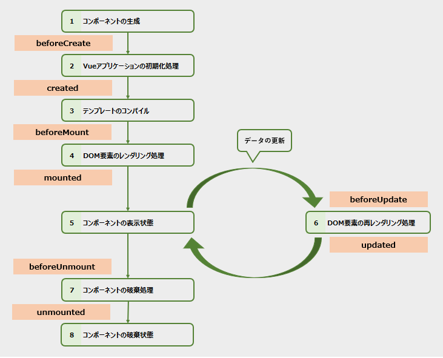

# Vueのライフサイクル
1. Vueアプリケーションが起動
  
  [beforeCreate]

2. Vueアプリケーションの初期化処理
  
  [created]

3. コンポーネントの解析処理

  [beforeMouted]

4. レンダリング処理

[mounted]

5. 表示処理

[beforeUpdate] 
6. リアクティブシステムによる再レンダリング処理
[updated]

7. 非表示処理
8. 非表示状態

1. Vueアプリケーションが起動
2. Vueアプリケーションの初期化処理が行われる  
  この段階でスクリプトブロック内のコードが実行され、テンプレート変数や算出プロパティ、メソッドなどの準備される。

3. コンポーネントの解析処理が行われる  
  これによりテンプレートブロック内のコードが解析あれ、タグ構成(DOM構造)が決定されます。
4. 3で決定したDOM構造がレンダリングされる
5. 4のレンダリングが処理が完了すると、表示状態になる。  
  この状態で初めて画面が見えるようになる。なおこの状態を公式ドキュメントでは`Mounted`と表現している
6. リアクティブシステムにより再レンダリングが必要にあった際に行われる処理。  
再レンダリングが終わると再び`Mounted`状態に戻る
7. 表示が不要になったコンポーネントに再び非表示処理を行う。
8. 非表示処理が完了すると、コンポーネントは非表示状態になる。  
この状態を公式では`UnMounted`

  